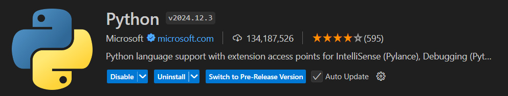

# Proyecto de Conversión de Videos

Este proyecto permite convertir videos de la carpeta "videos" al formato `.webm` y guardarlos en una carpeta "videos_convertidos".

## Pasos para la Conversión de Videos

1. **Clonar el repositorio**:  
   Abrir el CMD y posicionarse en la ubicación donde desees clonar el repositorio.

   ```bash
   git clone https://github.com/julianUTNFRC/conversion-videos-a-webm.git
   ```

2. **Moverme a la carpeta del proyecto**:

   ```bash
   cd conversion-videos-a-webm
   ```

3. **Abrir con VSCode**:

   ```bash
   code .
   ```

4. **En caso de no tener instalado Python en VSCode, instalar la siguiente extensión**:

   

5. **Instalar FFmpeg**:  
   El programa utiliza **FFmpeg** para realizar la conversión de videos. Sigue estos pasos para instalarlo:

   ### a. Descargar FFmpeg

   Descarga FFmpeg desde el sitio oficial: [https://ffmpeg.org/download.html](https://ffmpeg.org/download.html). Elige la versión adecuada para tu sistema operativo (Windows, macOS o Linux).

   ### b. Instalar FFmpeg

   - **En Windows**:
     1. Extrae los archivos descargados en una carpeta de tu elección.
     2. Encuentra la carpeta `bin` dentro de la instalación de FFmpeg y copia su ruta completa.
     3. Agrega esta ruta a las **Variables de entorno**:
        - Abre el **Panel de control** > **Sistema** > **Configuración avanzada del sistema** > **Variables de entorno**.
        - Edita la variable `PATH` y agrega la ruta completa de la carpeta `bin`.
     4. Verifica la instalación abriendo la terminal (CMD) y ejecutando:

        ```bash
        ffmpeg -version
        ```

   - **En macOS/Linux**:
     1. Abre la terminal.
     2. Ejecuta el siguiente comando para instalar FFmpeg:

        ```bash
        brew install ffmpeg   # En macOS con Homebrew
        sudo apt-get install ffmpeg  # En distribuciones basadas en Linux (Debian/Ubuntu)
        ```

     3. Verifica la instalación ejecutando:

        ```bash
        ffmpeg -version
        ```
    4. Deberas reiniciar tu dispositivo para que los cambios impacten correctamente.

   ### Guía en video
   También puedes seguir este video para una explicación visual del proceso de instalación:  
   [Cómo instalar FFmpeg](https://www.youtube.com/watch?v=0zN9oZ98ZgE)

6. **Convertir los videos**:  
   - Coloca todos los videos que quieras convertir en la carpeta `videos`.
   - Para correr el programa, abre el archivo `principal.py` y ejecuta el código utilizando el botón de "Play" que se encuentra arriba a la derecha en VSCode.
   - En la carpeta `videos_convertidos` encontrarás todos los videos convertidos en formato `.webm`.

7. **Recomendación**:  
   En caso de que necesites convertir más videos, te recomiendo limpiar la carpeta `videos` y luego agregar los nuevos videos, para que solo convierta los videos necesarios.
